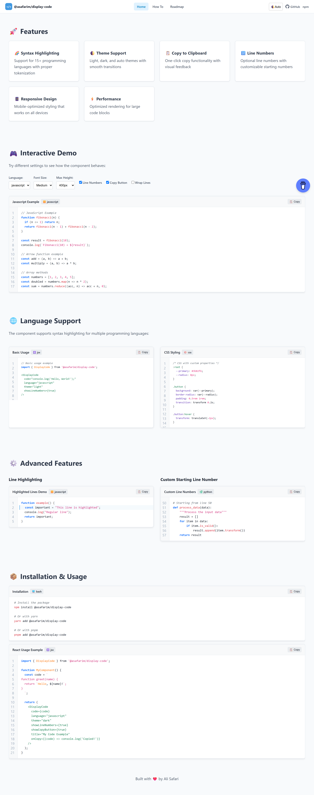
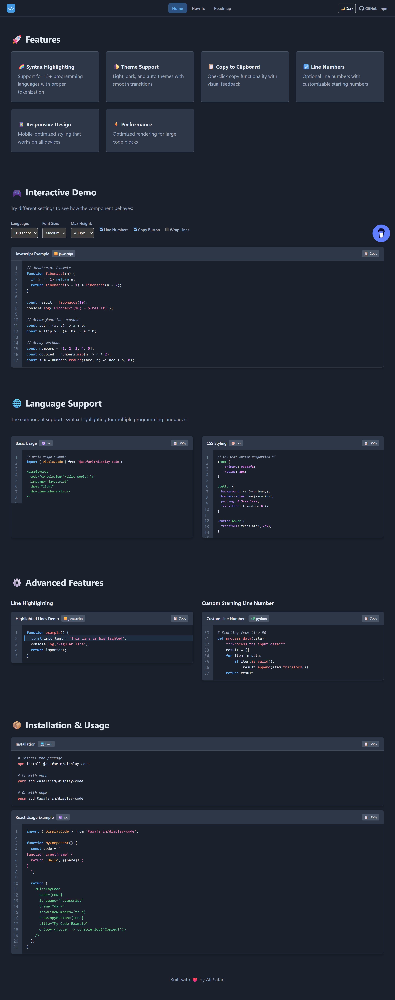
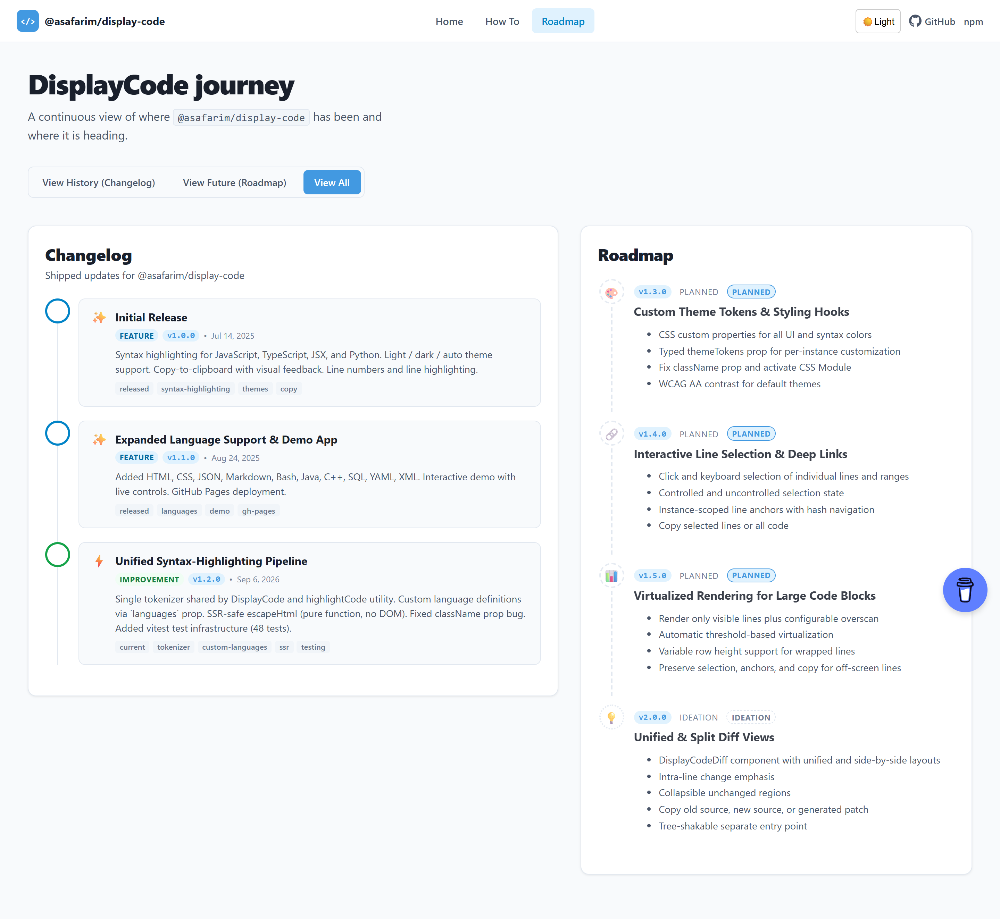
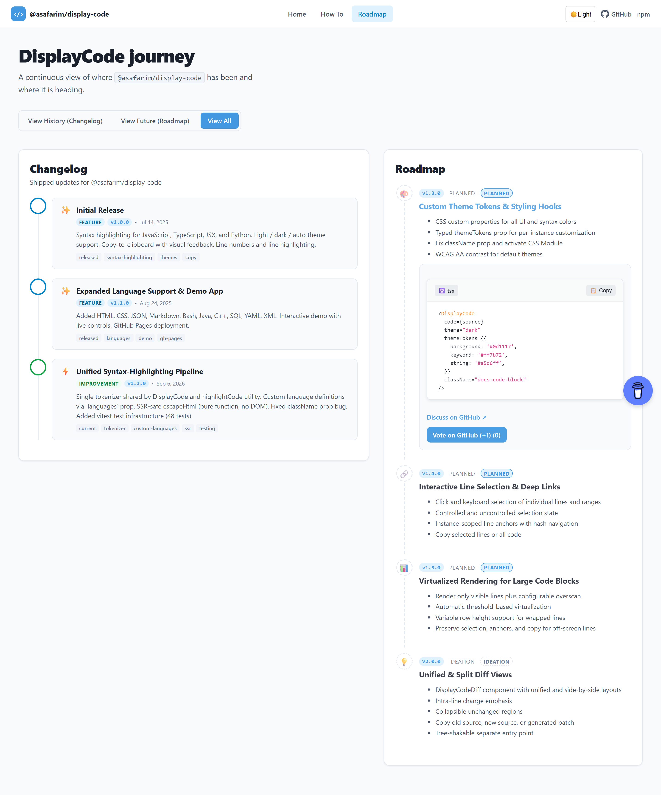

# @asafarim/display-code

A React component for displaying syntax-highlighted code blocks with copy functionality, theme support, and a unified tokenizer pipeline.





---

## Live Demo

- **Home**: [alisafari-it.github.io/display-code/](https://alisafari-it.github.io/display-code/)
- **How To**: [alisafari-it.github.io/display-code/how-to](https://alisafari-it.github.io/display-code/how-to)
- **Roadmap**: [alisafari-it.github.io/display-code/roadmap](https://alisafari-it.github.io/display-code/roadmap)

Run the demo locally:

```bash
pnpm install
pnpm demo
```

---

## Install

```bash
npm install @asafarim/display-code
# or
pnpm add @asafarim/display-code
# or
yarn add @asafarim/display-code
```

---

## Quick Start

```tsx
import { DisplayCode } from '@asafarim/display-code';

function App() {
  return (
    <DisplayCode
      code="console.log('Hello, World!');"
      language="javascript"
      theme="light"
      showLineNumbers={true}
      showCopyButton={true}
      title="Hello World Example"
    />
  );
}
```

---

## Public API

| Export | Kind | Notes |
|---|---|---|
| `DisplayCode` | Component | The main code display component |
| `highlightCode` | Utility | Highlight code and return HTML string |
| `tokenize` | Utility | Tokenize code into structured tokens |
| `splitTokensByLines` | Utility | Split a token stream into per-line arrays |
| `copyToClipboard` | Utility | Copy text to clipboard |
| `getLanguageIcon` | Utility | Get emoji icon for a language |
| `escapeHtml` | Utility | Pure HTML escaping (SSR-safe) |
| `detectLanguage` | Utility | Auto-detect language from code content |
| `languages` | Registry | Built-in language definitions |
| `DisplayCodeProps` | Type | Props interface |
| `SupportedLanguage` | Type | Union of built-in language IDs |
| `LanguageDefinition` | Type | Custom language definition shape |
| `HighlightRule` | Type | Single highlighting rule |
| `Token` | Type | Token produced by the tokenizer |

---

## Props

| Prop | Type | Default | Description |
|---|---|---|---|
| `code` | `string` | — | **Required**. The code to display |
| `language` | `string` | auto-detect | Language for syntax highlighting |
| `languages` | `Record<string, LanguageDefinition>` | — | Custom language definitions |
| `theme` | `'light' \| 'dark' \| 'auto'` | `'light'` | Color theme |
| `showLineNumbers` | `boolean` | `false` | Show line numbers |
| `showCopyButton` | `boolean` | `true` | Show copy-to-clipboard button |
| `title` | `string` | — | Header title for the code block |
| `maxHeight` | `string` | `'500px'` | Max height before scrolling |
| `wrapLines` | `boolean` | `false` | Wrap long lines instead of scrolling |
| `className` | `string` | — | Custom CSS class for the container |
| `onCopy` | `(code: string) => void` | — | Callback when code is copied |
| `fontSize` | `'small' \| 'medium' \| 'large'` | `'medium'` | Font size |
| `highlightLines` | `number[]` | `[]` | Line numbers to highlight |
| `startLineNumber` | `number` | `1` | Starting line number |
| `tabSize` | `number` | `2` | Tab size in spaces |
| `showLanguageLabel` | `boolean` | `true` | Show language badge in header |

---

## Supported Languages

16 built-in languages with dedicated highlighting rules:

| Language | ID | Extensions |
|---|---|---|
| JavaScript | `javascript` | `.js`, `.mjs` |
| TypeScript | `typescript` | `.ts` |
| JSX | `jsx` | `.jsx` |
| TSX | `tsx` | `.tsx` |
| HTML | `html` | `.html`, `.htm` |
| CSS | `css` | `.css` |
| JSON | `json` | `.json` |
| Markdown | `markdown` | `.md`, `.markdown` |
| Bash | `bash` | `.sh`, `.bash` |
| Python | `python` | `.py` |
| Java | `java` | `.java` |
| C++ | `cpp` | `.cpp`, `.cc`, `.cxx`, `.hpp`, `.h` |
| SQL | `sql` | `.sql` |
| YAML | `yaml` | `.yaml`, `.yml` |
| XML | `xml` | `.xml` |
| Plain Text | `plaintext` | `.txt` |

Unknown language identifiers fall back to **plaintext** (not JavaScript).

---

## Features

### Unified Tokenizer Pipeline

Both `DisplayCode` and `highlightCode` share a single canonical tokenizer. This ensures consistent highlighting whether you render via the component or generate HTML strings.

```tsx
import { tokenize, splitTokensByLines } from '@asafarim/display-code';

const tokens = tokenize('const x = 1;', 'javascript');
// → [{ type: 'keyword', content: 'const' }, { type: 'plain', content: ' ' }, ...]

const lines = splitTokensByLines(tokens);
// → [[{ type: 'keyword', content: 'const' }, ...]]
```

### Custom Language Definitions

Define your own languages without mutating the global registry:

```tsx
const graphqlDef: LanguageDefinition = {
  name: 'GraphQL',
  extensions: ['.graphql'],
  keywords: ['type', 'query', 'mutation'],
  rules: [
    { pattern: /\b(type|query|mutation)\b/g, className: 'keyword' },
    { pattern: /\b[A-Z][a-zA-Z0-9]*\b/g, className: 'class-name' },
  ],
};

<DisplayCode
  code="type User { name: String }"
  language="graphql"
  languages={{ graphql: graphqlDef }}
/>
```

### Multiline Constructs

Block comments, template literals, and triple-quoted strings retain their token classification across rendered lines.

### SSR-Safe

`escapeHtml` and `tokenize` are pure functions with no `window` or `document` dependency. They work in Node.js for server-side rendering.

### XSS Prevention

All token content is HTML-escaped before rendering. Script tags and HTML in code input are displayed as text, never injected as executable markup.

### Theme Support

Light, dark, and auto (system preference) themes:

```tsx
<DisplayCode code={code} language="python" theme="dark" />
```

### Line Highlighting

```tsx
<DisplayCode
  code={code}
  language="javascript"
  showLineNumbers={true}
  highlightLines={[3, 4]}
/>
```

### Copy to Clipboard

```tsx
<DisplayCode
  code={code}
  language="bash"
  showCopyButton={true}
  onCopy={(code) => console.log('Copied:', code.length, 'chars')}
/>
```

### Line Numbers with Custom Start

```tsx
<DisplayCode
  code={code}
  language="javascript"
  showLineNumbers={true}
  startLineNumber={42}
/>
```

---

## How To Page


The [How To page](https://alisafari-it.github.io/display-code/how-to) demonstrates every prop with live examples. Each example has an **eye icon** button to reveal the source code that produced it, and a **copy** button to copy the snippet.


---

## Roadmap



The [Roadmap page](https://alisafari-it.github.io/display-code/roadmap) shows the project's changelog and future plans, with GitHub issue integration for voting and discussion.



---

## Utility Functions

```tsx
import {
  highlightCode,
  tokenize,
  copyToClipboard,
  getLanguageIcon,
  escapeHtml,
  detectLanguage,
  languages,
} from '@asafarim/display-code';

// Highlight code → HTML string
const html = highlightCode('const x = 1;', 'javascript');

// Tokenize → structured tokens
const tokens = tokenize('const x = 1;', 'javascript');

// Copy to clipboard
await copyToClipboard('text to copy');

// Get language icon
const icon = getLanguageIcon('javascript'); // '🟨'

// Escape HTML (pure, SSR-safe)
const escaped = escapeHtml('<script>'); // '&lt;script&gt;'

// Detect language from content
const lang = detectLanguage('def hello(): pass'); // 'python'

// Access the built-in language registry
const jsDef = languages.javascript;
```

---

## TypeScript

Full TypeScript support with strict mode:

```tsx
import { DisplayCode, DisplayCodeProps, SupportedLanguage } from '@asafarim/display-code';

const props: DisplayCodeProps = {
  code: 'const x = 1;',
  language: 'typescript' as SupportedLanguage,
  theme: 'dark',
  showLineNumbers: true,
};
```

---

## Development

```bash
# Install dependencies
pnpm install

# Build the library
pnpm build

# Run the demo dev server
pnpm demo

# Run tests
pnpm test

# Build the demo for production
pnpm build && cd demo && pnpm build
```

### Project Structure

```
display-code/
├── src/
│   ├── components/
│   │   └── DisplayCode.tsx       # Main component
│   ├── utils/
│   │   ├── tokenizer.ts          # Unified tokenizer
│   │   ├── syntax-highlighter.ts # Language registry
│   │   └── index.ts              # Utilities (escapeHtml, highlightCode, etc.)
│   ├── types/
│   │   └── index.ts              # Type definitions
│   ├── __tests__/
│   │   ├── tokenizer.test.ts     # Tokenizer tests (27 tests)
│   │   └── highlightCode.test.ts # Utility tests (21 tests)
│   └── index.ts                  # Public exports
├── demo/
│   ├── src/
│   │   ├── App.tsx               # Home page + routing
│   │   ├── HowToPage.tsx         # Usage guide with source reveal
│   │   ├── RoadmapPage.tsx       # Changelog + roadmap with GitHub issues
│   │   ├── SiteNav.tsx           # Navigation bar
│   │   └── index.css             # Demo styles
│   └── vite.config.ts
├── rollup.config.js
└── package.json
```

---

## Browser Support

- Chrome 60+
- Firefox 60+
- Safari 12+
- Edge 79+

---

## License

MIT

---

## Contributing

Contributions are welcome! Please see our [Contributing Guide](CONTRIBUTING.md) for details.

## Roadmap Issues

- [#1 – Unified syntax-highlighting pipeline](https://github.com/AliSafari-IT/display-code/issues/1) ✅
- [#2 – Custom theme tokens and styling hooks](https://github.com/AliSafari-IT/display-code/issues/2)
- [#3 – Interactive line selection and deep links](https://github.com/AliSafari-IT/display-code/issues/3)
- [#4 – Virtualize large code blocks](https://github.com/AliSafari-IT/display-code/issues/4)
- [#5 – Unified and split diff views](https://github.com/AliSafari-IT/display-code/issues/5)
