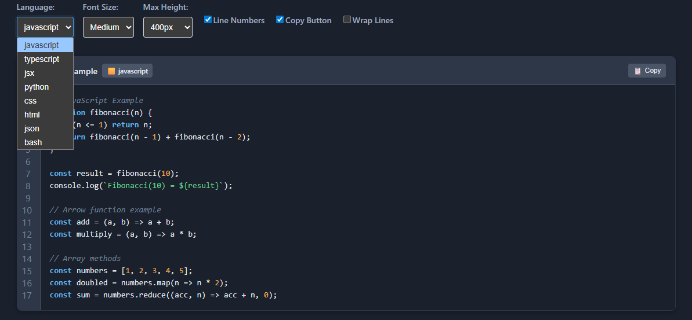

# @asafarim/display-code

A React component for displaying syntax-highlighted code blocks with copy functionality and theme support.

## 🚀 Demo



Experience the full power of the DisplayCode component with our [interactive demo](https://alisafari-it.github.io/asafarim-webapp/packages/display-code/).

To run the demo locally:

```bash
pnpm run demo
```

For more details about the demo, check out the [Demo README](demo/README.md).

The demo showcases:

- 🌈 Syntax highlighting for multiple languages (JavaScript, TypeScript, JSON, Python, JSX, and more)
- 🌓 Light/Dark/Auto theme switching
- 📋 Copy to clipboard functionality
- 🔢 Line numbers
- 🎨 Customizable styling
- 📱 Responsive design
- ✨ Line highlighting

## Installation

```bash
npm install @asafarim/display-code
```

## Usage

```tsx
import { DisplayCode } from '@asafarim/display-code';

const MyComponent = () => {
  return (
    <DisplayCode
      code={`function hello() {
  console.log("Hello, World!");
}`}
      language="javascript"
      theme="light"
      showLineNumbers={true}
      showCopyButton={true}
      title="Hello World Example"
    />
  );
};
```

## Props

| Prop | Type | Default | Description |
|------|------|---------|-------------|
| `code` | `string` | - | **Required**. The code to display |
| `language` | `SupportedLanguage` | auto-detect | Programming language for syntax highlighting |
| `theme` | `'light' \| 'dark' \| 'auto'` | `'light'` | Theme for the code block |
| `showLineNumbers` | `boolean` | `false` | Show line numbers |
| `showCopyButton` | `boolean` | `true` | Show copy to clipboard button |
| `title` | `string` | - | Optional title for the code block |
| `maxHeight` | `string` | `'500px'` | Maximum height of the code block |
| `wrapLines` | `boolean` | `false` | Wrap long lines |
| `className` | `string` | `''` | Additional CSS classes |
| `onCopy` | `(code: string) => void` | - | Callback when code is copied |
| `fontSize` | `'small' \| 'medium' \| 'large'` | `'medium'` | Font size |
| `highlightLines` | `number[]` | `[]` | Array of line numbers to highlight |
| `startLineNumber` | `number` | `1` | Starting line number |
| `tabSize` | `number` | `2` | Tab size in spaces |
| `showLanguageLabel` | `boolean` | `true` | Show language label |

## Supported Languages

The component supports syntax highlighting for:

- **JavaScript** (`.js`, `.mjs`)
- **TypeScript** (`.ts`)
- **JSX** (`.jsx`)
- **TSX** (`.tsx`)
- **HTML** (`.html`, `.htm`)
- **CSS** (`.css`)
- **JSON** (`.json`)
- **Markdown** (`.md`, `.markdown`)
- **Bash** (`.sh`, `.bash`)
- **Python** (`.py`)
- **Java** (`.java`)
- **C++** (`.cpp`, `.cc`, `.cxx`, `.hpp`, `.h`)
- **SQL** (`.sql`)
- **YAML** (`.yaml`, `.yml`)
- **XML** (`.xml`)
- **Plain Text** (`.txt`)

## Features

### 🌈 Syntax Highlighting

Built-in syntax highlighting for 15+ programming languages with proper tokenization:

```tsx
<DisplayCode
  code="const message = 'Hello, World!';"
  language="javascript"
/>
```

### 🌓 Theme Support

Support for light, dark, and auto (system preference) themes:

```tsx
<DisplayCode
  code="print('Hello, World!')"
  language="python"
  theme="dark"
/>
```

### 📋 Copy to Clipboard

One-click copy functionality with visual feedback:

```tsx
<DisplayCode
  code="npm install @asafarim/display-code"
  language="bash"
  showCopyButton={true}
  onCopy={(code) => console.log('Copied:', code)}
/>
```

### 🔢 Line Numbers

Optional line numbers with customizable starting number:

```tsx
<DisplayCode
  code="function example() {\n  return 'Hello';\n}"
  language="javascript"
  showLineNumbers={true}
  startLineNumber={10}
/>
```

### 🎨 Line Highlighting

Highlight specific lines to draw attention:

```tsx
<DisplayCode
  code="line 1\nline 2\nline 3"
  language="plaintext"
  highlightLines={[2]}
/>
```

### 📱 Responsive Design

Fully responsive with mobile-optimized styling:

```tsx
<DisplayCode
  code="responsive code"
  language="javascript"
  wrapLines={true}
  fontSize="small"
/>
```

## Advanced Usage

### Custom Styling

```tsx
<DisplayCode
  code="const customized = true;"
  language="javascript"
  className="my-custom-code-block"
  maxHeight="300px"
  fontSize="large"
/>
```

### Auto Language Detection

```tsx
<DisplayCode
  code={`import React from 'react';
export default function Component() {
  return <div>Hello</div>;
}`}
  // language is auto-detected as 'tsx'
/>
```

### Multi-line Code with Tabs

```tsx
<DisplayCode
  code={`function example() {
\tif (condition) {
\t\treturn true;
\t}
}`}
  language="javascript"
  tabSize={4}
  showLineNumbers={true}
/>
```

## TypeScript Support

Full TypeScript support with comprehensive type definitions:

```tsx
import { DisplayCode, DisplayCodeProps, SupportedLanguage } from '@asafarim/display-code';

const props: DisplayCodeProps = {
  code: 'const typescript = "awesome";',
  language: 'typescript' as SupportedLanguage,
  theme: 'dark',
  showLineNumbers: true
};

<DisplayCode {...props} />
```

## Utility Functions

The package also exports utility functions:

```tsx
import { 
  highlightCode, 
  copyToClipboard, 
  getLanguageIcon, 
  detectLanguage 
} from '@asafarim/display-code';

// Highlight code manually
const highlighted = highlightCode('const x = 1;', 'javascript');

// Copy to clipboard
await copyToClipboard('text to copy');

// Get language icon
const icon = getLanguageIcon('javascript'); // Returns '🟨'

// Detect language
const lang = detectLanguage('def hello(): pass'); // Returns 'python'
```

## Styling

The component uses CSS Modules for styling. You can override styles by targeting the CSS classes:

```css
.my-custom-code-block {
  border: 2px solid #0066cc;
  border-radius: 12px;
}

.my-custom-code-block .highlight-keyword {
  color: #ff6b6b;
  font-weight: bold;
}
```

## Browser Support

- Chrome 60+
- Firefox 60+
- Safari 12+
- Edge 79+

## Performance

- Lazy syntax highlighting
- Efficient re-rendering
- Minimal bundle size
- Optimized for large code blocks

## License

MIT

## 🎯 Features

- **Syntax Highlighting**: 15+ languages with proper tokenization
- **Theme Support**: Light, dark, and auto themes
- **Copy Functionality**: One-click copy with visual feedback
- **Line Numbers**: Optional line numbers with custom starting numbers
- **Line Highlighting**: Highlight specific lines
- **Responsive Design**: Mobile-optimized styling
- **TypeScript Support**: Full type safety
- **Auto Detection**: Automatic language detection
- **Customizable**: Extensive styling options
- **Performance**: Optimized for large code blocks

## 🔧 Development

To run the demo locally:

```bash
# Install dependencies
npm install

# Build the package
npm run build

# Start the demo
npm run demo
```

## 🤝 Contributing

Contributions are welcome! Please see our [Contributing Guide](../../CONTRIBUTING.md) for details.
