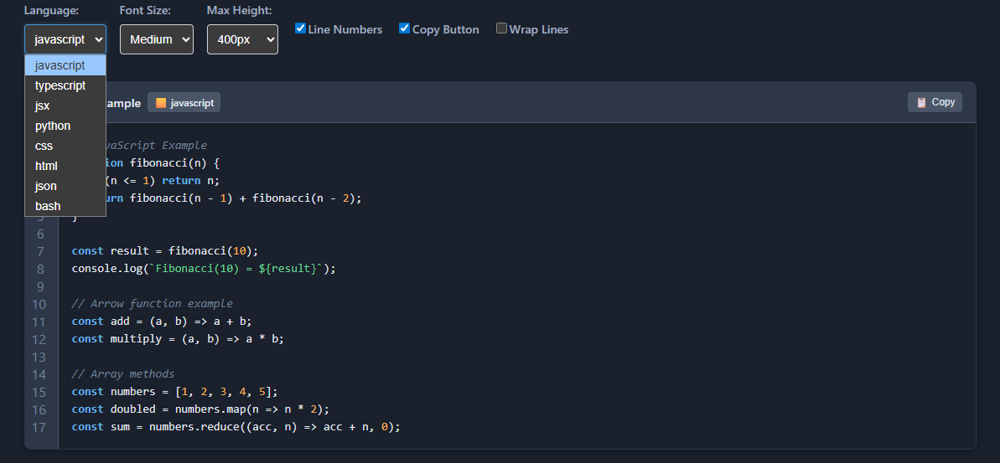

# DisplayCode Component Demo

This interactive demo showcases the features and capabilities of the `@asafarim/display-code` React component.



## Features Demonstrated

The demo allows you to interactively explore:

- **Syntax Highlighting**: Support for multiple programming languages including JavaScript, TypeScript, JSON, Python, JSX, and more
- **Theme Support**: Toggle between light, dark, and auto themes
- **Line Numbers**: Enable or disable line numbers
- **Copy Button**: One-click code copying functionality
- **Custom Line Highlighting**: Highlight specific lines of code
- **Customizable Max Height**: Control the maximum height of the code display
- **Font Size Control**: Adjust the font size for better readability

## Running the Demo Locally

To run the demo on your local machine:

```bash
# Navigate to the demo directory
cd packages/display-code/demo

# Install dependencies
pnpm install

# Start the development server
pnpm dev
```

The demo will be available at `http://localhost:5173` (or another port if 5173 is in use).

## Usage Examples

The demo includes several examples showing how to use the DisplayCode component in different scenarios:

1. **Basic Usage**: Simple implementation with default settings
2. **Custom Styling**: Examples of styling customization options
3. **Language Support**: Demonstrations of different language syntax highlighting
4. **Interactive Features**: Examples of the component's interactive capabilities

## Code Structure

The demo is built with:

- React
- TypeScript
- Vite

The main demo application is in `src/App.tsx`, which contains all the examples and the interactive controls.

## Deployment

This demo is automatically deployed to GitHub Pages when changes are pushed to the main branch. You can view the live demo at [ASafariM DisplayCode Demo](https://alisafari-it.github.io/asafarim-webapp/packages/display-code/).
